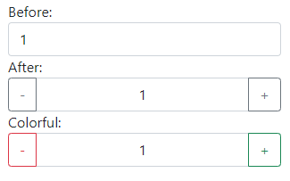

Very simple, fast and lightweight (> 3K) jQuery plugin for Bootstrap's input-group to render number input more user-friendly.

## Usage

```javascript
$(SELECTOR).bootstrapNumber({
	upClass: success/primary/danger/warning/default,
	downClass: success/primary/danger/warning/default,
	center: true/false
});
```

## Copyright and license

Code released under the [Apache 2.0](https://www.apache.org/licenses/LICENSE-2.0.html).
